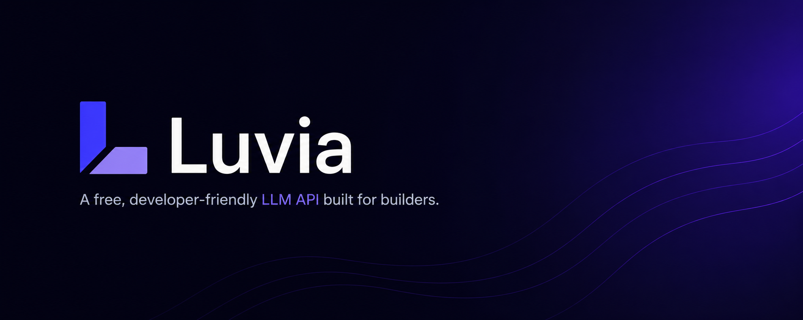

[LUVIA](https://luvia.chat) is a privately operated AI product built to deliver a polished,
controlled, and modern interface around local model inference.

It is designed as a complete user-facing experience rather than a raw model
endpoint, combining presentation, access control, monitoring, and product-level
structure into a single cohesive platform.

NOTE : This project was vibe codded with tweaks done by me manually to learn how to read the code and what it dose.
## About

LUVIA focuses on making AI interaction feel intentional, reliable, and
productized.

The project emphasizes:

- a refined frontend experience
- controlled model access
- operational visibility
- lightweight analytics
- a tightly managed private infrastructure layer

## Product Direction

LUVIA is intended to function as a real end-user product, not as a public
server template or generalized self-hosting kit.

Its purpose is to provide:

- a branded AI experience
- a structured access model
- a more curated interface than a direct local model 
- private infrastructure backing the product
- designed for a controlled hosted experience

## Goal
This project was so i can learn how AI systems work and how API's work as well and
I am very intrested in AI and API's so I wanted to try to host one myself!

## Technology

Built with:

- Python
- FastAPI
- React
- Vite
- Tailwind CSS
- SQLite
- Nginx
